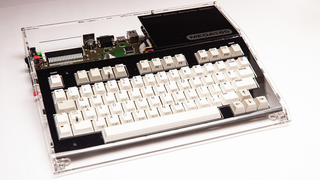

# Welcome to the MEGA65!

The **MEGA65** is a brand new retro-computer that is backwards compatible with the **Commodore 64** and
**Commodore 65** home computers, but which boasts many advanced features.

The **MEGA65** will soon be available to purchase, following the successful release of 100 pre-series units.
The pre-series units came in a special clear acrylic case:

