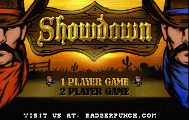

# Showdown

**Showdown Collector's edition is available for pre-order at poly.play! Buy a lovingly made physical edition on diskette and sd-card here:** [https://www.polyplay.xyz/Showdown-Collectors-Edition-MEGA65\_1](https://www.polyplay.xyz/Showdown-Collectors-Edition-MEGA65_1)

Showdown is a 1 or 2-player action shooter for the Mega65. The game is inspired by a host of older titles with the same theme, going all the way back to Gun Fight from 1975.

You play a cowboy out to win a fierce gun duel. The first one to outwit and knock down the opponent 5 times is the winner of the duel.

Giddy-up and get ready to fight!

**Instructions:**

Each gun can carry 5 bullets. You reload by manually replacing the bullets with a click of the joystick button, or you can pick up bullet packs from the ground. But beware! If your opponent catches you out of the safety of the cacti, then you might get knocked down!

Explosive crates appear around the play area. They explode when shot, so better stay away from them if you value you life, cowboy!

The game is best when played with a friendemy. It is a lot of fun to taunt a friend as they hit the ground and you win the Showdown!

F7 can be used to exit the current game and go back to the title screen. Just in case you choose a 2-player game and your friend doesn't show up for the gun duel!

**Controls:**

Joystick in port 2 for 1-player games.

Download now, for $5, and get ready to fight!

**Works on: Real Mega65 hardware, Xemu emulator (on multiple patforms), and Nexys with Mega65 core.**

